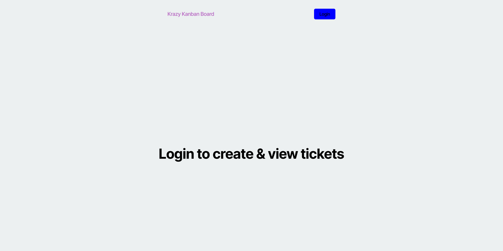
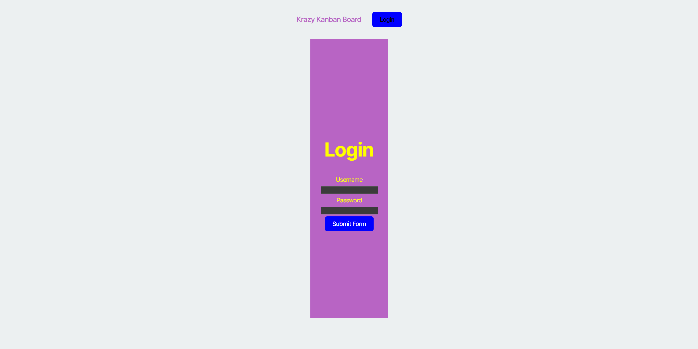
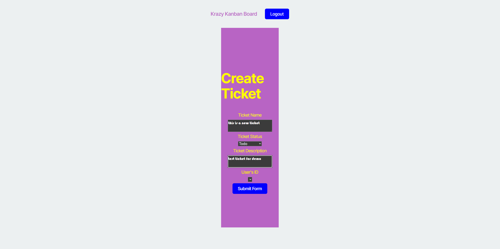
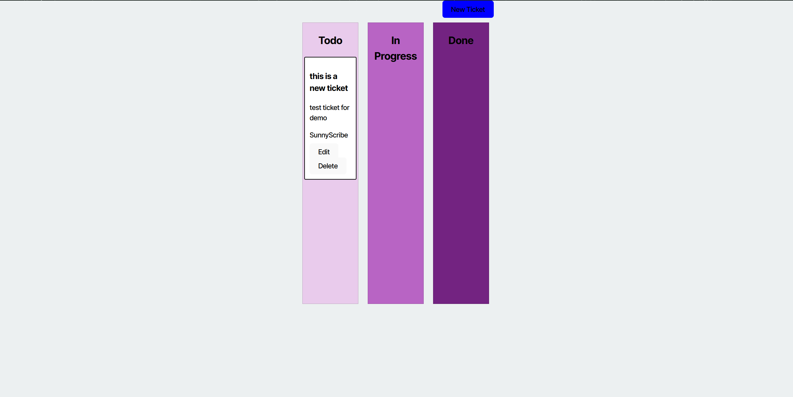
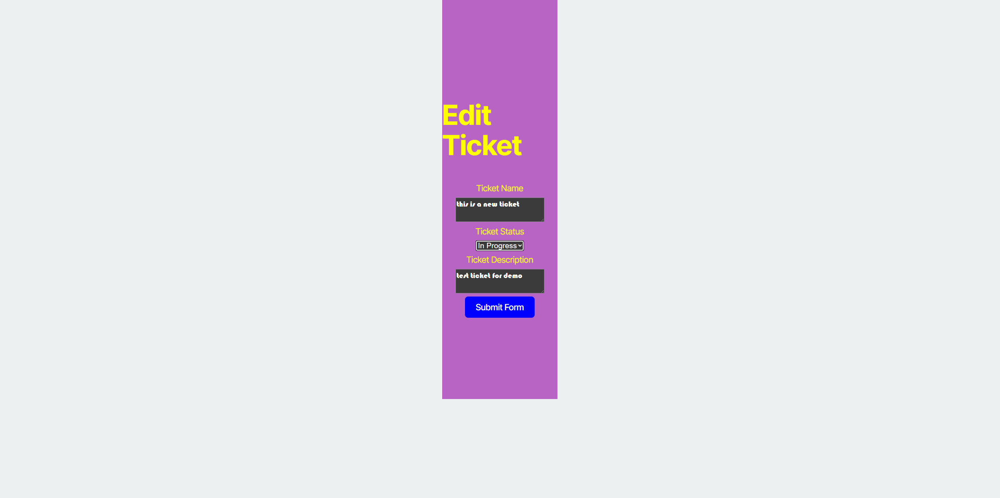
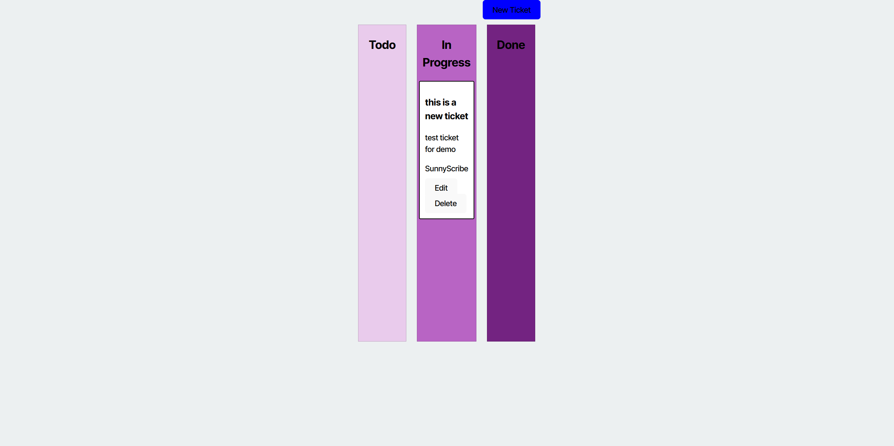
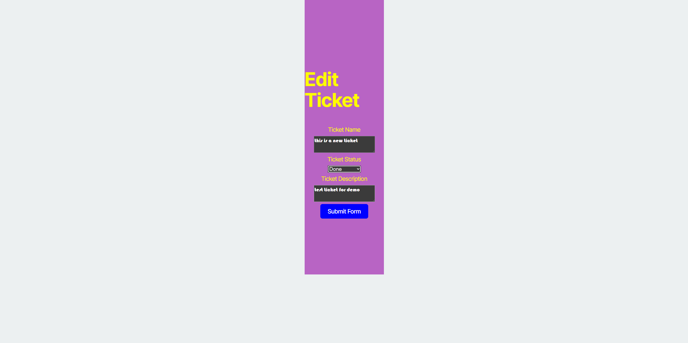
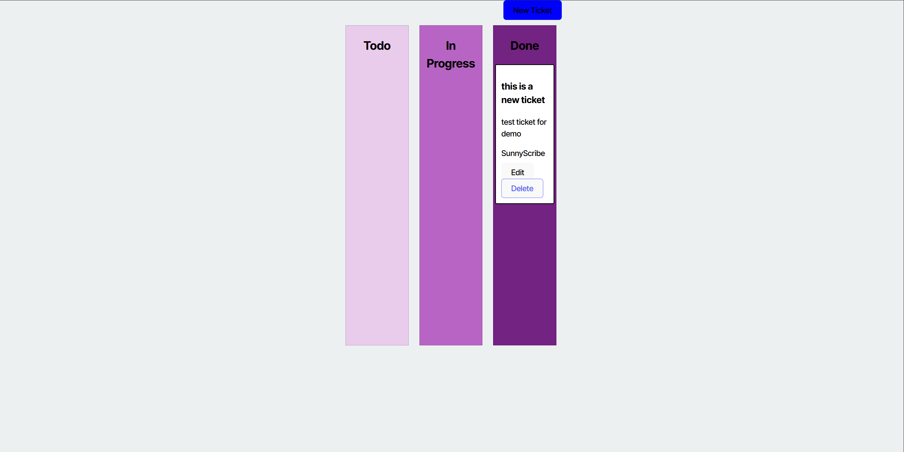
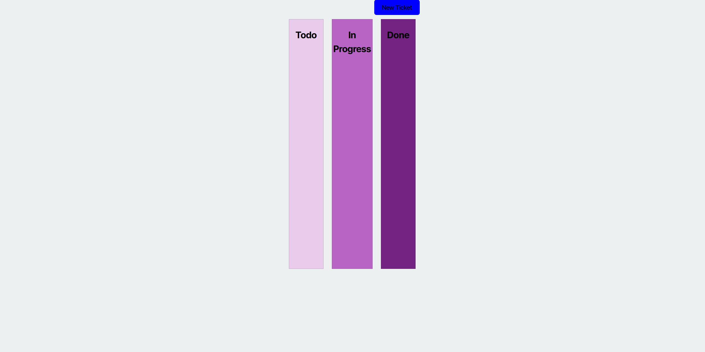

# Full-Stack React Kanban Board with JWT Authentication

A Kanban board application with secure login powered by JSON Web Tokens (JWT). This project extends a starter application by adding:

- A React front‑end for managing your tasks in three columns (To Do, In Progress, Done)
- A Node.js/Express back‑end API with PostgreSQL for data persistence
- JWT‑based authentication and protected routes
- Deployment of both client and server on Render

---

## Table of Contents

- [User Story & Acceptance Criteria](#user-story--acceptance-criteria)  
- [Live Website](#live-website)  
- [Screenshots](#screenshots)  
- [Getting Started](#getting-started)  
  - [Prerequisites](#prerequisites)  
  - [Installation](#installation)  
  - [Environment Variables](#environment-variables)  
  - [Running the App Locally](#running-the-app-locally)  
- [Features](#features)  
- [Project Structure](#project-structure)  
- [Technologies Used](#technologies-used)  
- [Contributing](#contributing)  
- [License](#license)  

---

## User Story & Acceptance Criteria

### User Story

    AS A member of an agile team    
    I WANT a Kanban board with a secure login page
    SO THAT I can securely access and manage my work tasks

### Acceptance Criteria

    Login page with username & password inputs

    Valid credentials produce a JWT, redirect to main board

    Invalid credentials show an error message

    Authenticated requests include JWT in headers

    Logout removes JWT and redirects to login

    Accessing /board without a token redirects to login

    Session expires after defined inactivity, requiring re‑login

## Live Website

🔗 [Krazy Kanban Board ](https://kanban-board-t0wb.onrender.com/)  

### Video Demo

🔗 [Viedo Demo](https://app.screencastify.com/v3/watch/sk8FBmI3PheLLKrlhhDd)

---

## Screenshots












---

## Getting Started

### Prerequisites

- [Node.js (v16+)](https://nodejs.org/)  
- [npm](https://www.npmjs.com/) or [yarn](https://yarnpkg.com/)  
- [PostgreSQL](https://www.postgresql.org/) (or use Render’s managed PostgreSQL)  

### Installation

1. **Clone the repositories**  
   ```bash
   git clone https://github.com/Ajthompson88/M14KanbanBoardChallenge


2. **Clone the Repository**
    ```bash
    cd M14KanbanBoardChallenge 
    npm install

    cd ../lient
    npm install

## Evironment Variables

   ### PostgreSQL

    DB_URL = "Your URI here"
   ### JWT

    JWT_SECRET_KEY='Your token here'
    ACCESS_TOKEN_SECRET= 'Your toke here'

   ### Server Port

    PORT=3001
    DB_NAME='Your DB name'
    DB_USER='Your DB username'
    DB_PASSWORD='Your password here'
    
   ### Client
    RENDER_DEPLOY_HOOK = 'Your link here'

   ### Running the App Locally

1. **Start the Server**
    ```bash
    cd server
    npm run server

2. **Start the Client**
    ``bash
    cd client
    npm run start:dev

## **Features**

- **Secure Login & Logout**

    - JWT issuance on successful login

    - Token stored in localStorage

    - Protected routes redirect unauthenticated users back to login

- **Kanban Board**

    - Create, read, update, delete tickets

    - Drag‑and‑drop or button controls to move tickets between To Do, In Progress, and Done

    - Real‑time UI updates

- **Session Expiration**

    - Automatic logout when JWT expires

- **Deployment**

    - Both client and server are deployed on Render with environment variables configured

## Project Structure

    M14KanbanBoardChallenge/
    ├── client/
    │   ├── public/
    │   │   ├── index.html
    │   │   └── favicon.ico
    │   ├── src/
    │   │   ├── api/
    │   │   │   ├── ticketAPI.ts
    │   │   │   └── userAPI.ts
    │   │   ├── components/
    │   │   │   ├── KanbanColumn.tsx
    │   │   │   ├── TicketCard.tsx
    │   │   │   └── Navbar.tsx
    │   │   ├── interfaces/
    │   │   │   ├── TicketData.ts
    │   │   │   └── UserData.ts
    │   │   ├── pages/
    │   │   │   ├── CreateTicket.tsx
    │   │   │   ├── KanbanBoard.tsx
    │   │   │   └── Login.tsx
    │   │   ├── App.tsx
    │   │   ├── index.tsx
    │   │   ├── index.css
    │   │   └── react-app-env.d.ts
    │   ├── package.json
    │   └── tsconfig.json
    ├── server/
    │   ├── controllers/
    │   │   ├── authController.js
    │   │   ├── ticketController.js
    │   │   └── userController.js
    │   ├── models/
    │   │   ├── Ticket.js
    │   │   └── User.js
    │   ├── routes/
    │   │   ├── authRoutes.js
    │   │   ├── ticketRoutes.js
    │   │   └── userRoutes.js
    │   ├── middleware/
    │   │   └── authMiddleware.js
    │   ├── config/
    │   │   └── db.js
    │   ├── app.js
    │   ├── server.js
    │   └── package.json
    ├── README.md
    ├── .env
    ├── .gitignore
    └── package.json

## Technologies Used

    Front‑End: React, TypeScript, React Router, Axios

    Back‑End: Node.js, Express, TypeScript, JWT

    Database: PostgreSQL (via pg & knex or ORM of your choice)

    Deployment: Render (Web Services & PostgreSQL)

## Contributing

    1. Fork the repo

    2. Create a feature branch (git checkout -b feature/YourFeature)

    3. Commit your changes (git commit -m "Add YourFeature")

    4. Push to branch (git push origin feature/YourFeature)

    5 Open a Pull Request

## License

[MIT LICENSE](MIT-License) 